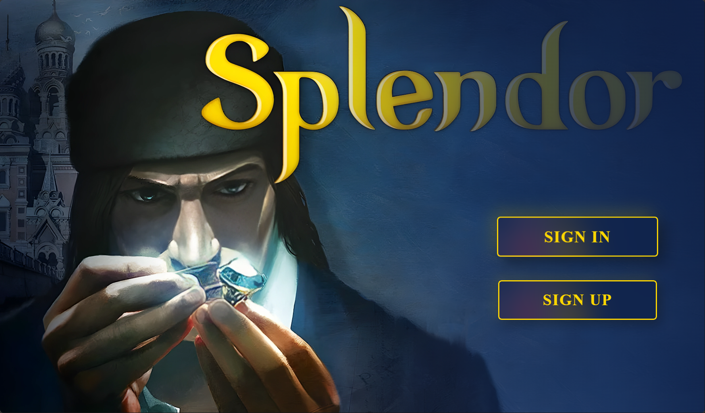
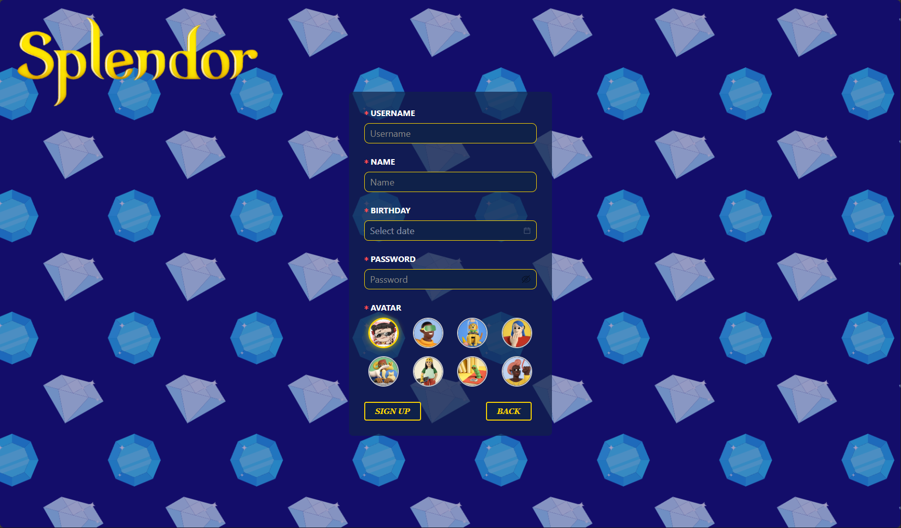
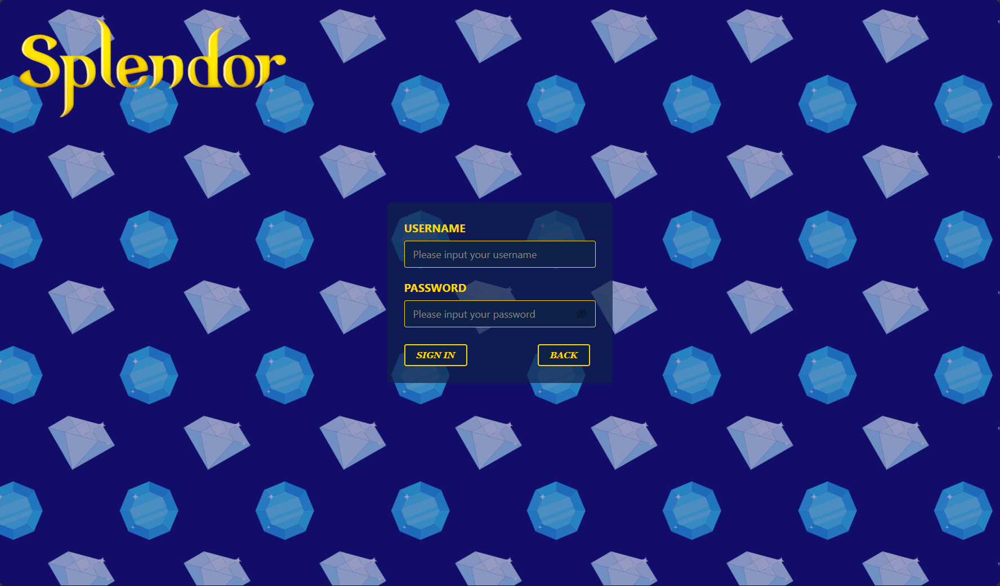
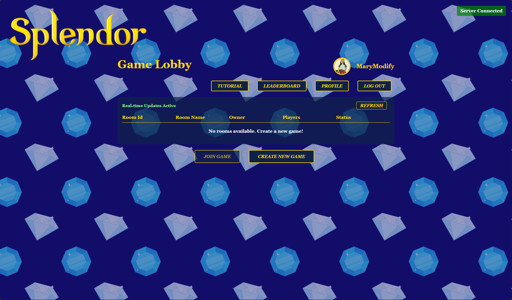
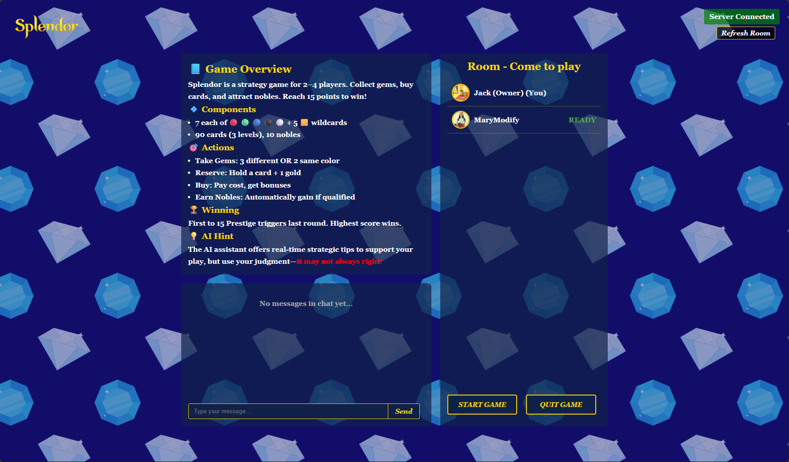
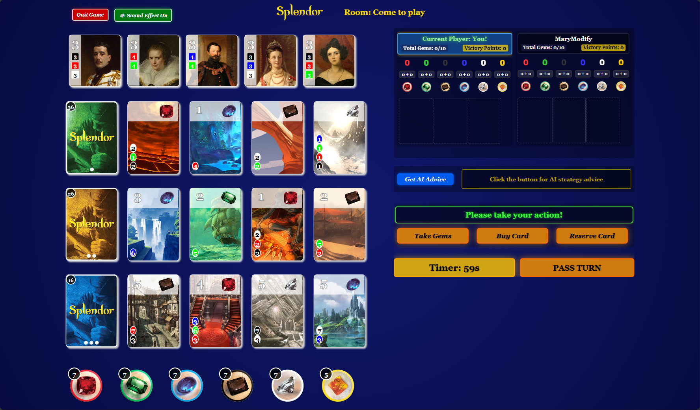
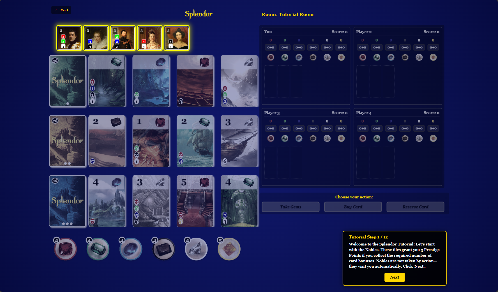
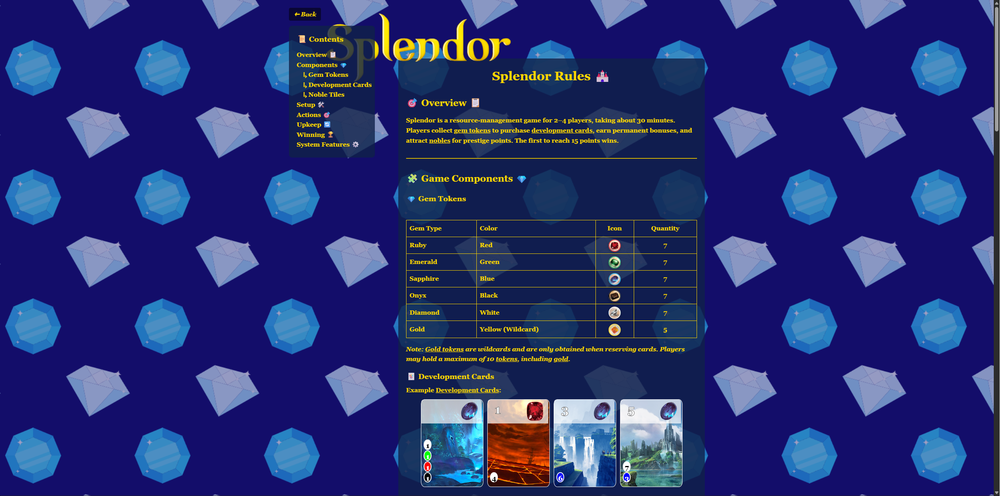

# Splendor Online Board Game

   
     


---

## Table of Contents

- [Splendor Online Board Game](#splendor-online-board-game)
  - [Table of Contents](#table-of-contents)
  - [Introduction](#introduction)
  - [Technologies](#technologies)
  - [High-Level Components](#high-level-components)
  - [Launch \& Deployment](#launch--deployment)
    - [Environment](#environment)
  - [Setup with Your IDE](#setup-with-your-ide)
    - [IntelliJ IDEA](#intellij-idea)
    - [VS Code](#vs-code)
  - [Building \& Running](#building--running)
  - [Illustrations](#illustrations)
  - [Roadmap](#roadmap)
  - [Authors \& Acknowledgement](#authors--acknowledgement)
  - [License](#license)
  - [Third-party Assets and Licenses](#third-party-assets-and-licenses)

## Introduction

Splendor Online is a web-based multiplayer adaptation of the popular board game Splendor, designed for 2–4 players. Each player takes turns collecting gems and purchasing development cards to build their trade network and earn prestige points.

On each turn, players can:

- Take gem tokens (emerald, diamond, sapphire, onyx, ruby)
- Buy development cards, which offer permanent gem bonuses and prestige(Victory points)
- Reserve cards for later use and gain a wildcard (gold token)

As you accumulate bonuses, Noble tiles may automatically join you if your gem bonuses meet their requirements—granting additional prestige points. The first player to reach 15 prestige(Victory points) triggers the endgame, and the player with the most points wins.

Key features:

- Real-time online matches with 2–4 players
- Turn timer to keep the game moving
- Optional AI Advisor for in-game strategic suggestions
- No download, no setup—just open the browser and start playing

Whether you're familiar with the tabletop version or trying it for the first time, Splendor Online provides a smooth and accessible way to enjoy the game with friends.

## Technologies

- **WebSockets (Custom JSON Protocol)**  
  We leverage Spring Boot’s native WebSocket support to power all real-time interactions—game state updates (`GAME_STATE`), chat (`CHAT_MESSAGE`), turn timers, and AI hint requests (`AI_HINT`). A single endpoint registers a `WebSocketHandler` on server startup, routing messages by `sessionId` and `roomId`. On the client, our `useWebSocket` hook handles connection lifecycle, automatic reconnection, JSON parsing, and dispatch into React Context.
- **Google Gemini API (AI Strategy Hints)**  
  To provide in-game strategic advice, the client emits an AI_HINT over WebSocket. The Spring service then calls Google’s Gemini generative-language endpoint (`gemini-2.0-flash`). We package a concise system prompt along with the current turn snapshot, and stream back the AI’s one-sentence recommendation (e.g. “Take 2 Blue Gems”) as an AI_HINT message. Usage is limited to one hints per player per game to balance assistance and performance.

## High-Level Components

The backend server consists of several main components：

### Controller

- [UserController](https://github.com/Haizhouzhou/sopra-fs25-group-28-server/blob/main/src/main/java/ch/uzh/ifi/hase/soprafs24/controller/UserController.java)
  Handles REST API endpoints related to user management, such as login, logout, and profile retrieval. It acts as the entry point for all HTTP-based user operations and delegates business logic to the corresponding service layer.

### Service

- [UserService](https://github.com/Haizhouzhou/sopra-fs25-group-28-server/blob/main/src/main/java/ch/uzh/ifi/hase/soprafs24/service/UserService.java)
  Provides business logic for user-related tasks, such as authentication and user data management. It is called by the UserController to process requests.
- [GeminiService](https://github.com/Haizhouzhou/sopra-fs25-group-28-server/blob/main/src/main/java/ch/uzh/ifi/hase/soprafs24/service/GeminiService.java)
  Responsible for handling requests to the external Gemini AI API. It processes player hint requests by communicating with the external service and returning suggestions to the frontend.

### WebSocket

- [WebSocketServer](https://github.com/Haizhouzhou/sopra-fs25-group-28-server/blob/main/src/main/java/ch/uzh/ifi/hase/soprafs24/websocket/WebSocketServer.java)
  Manages the WebSocket endpoint for real-time communication. It handles client connections, disconnections, and routing of messages between players and the server.

Within the websocket module, the following subcomponents organize the application logic:

- [game](https://github.com/Haizhouzhou/sopra-fs25-group-28-server/blob/main/src/main/java/ch/uzh/ifi/hase/soprafs24/websocket/game/Game.java)
  Contains core game logic, such as game state management, turn progression, and rule enforcement.

- [action](https://github.com/Haizhouzhou/sopra-fs25-group-28-server/tree/main/src/main/java/ch/uzh/ifi/hase/soprafs24/websocket/action)
  Includes various Action classes, each representing a possible player action (e.g., collecting gems, buying cards, reserving cards). Each action class performs validation and executes the corresponding logic.

- [util](https://github.com/Haizhouzhou/sopra-fs25-group-28-server/tree/main/src/main/java/ch/uzh/ifi/hase/soprafs24/websocket/util)

  Provides supporting classes, such as:

  - [Player](https://github.com/Haizhouzhou/sopra-fs25-group-28-server/blob/main/src/main/java/ch/uzh/ifi/hase/soprafs24/websocket/util/Player.java): Manages player-specific variables and state during the game.
  - [Card](https://github.com/Haizhouzhou/sopra-fs25-group-28-server/blob/main/src/main/java/ch/uzh/ifi/hase/soprafs24/websocket/util/Card.java) and [Noble](https://github.com/Haizhouzhou/sopra-fs25-group-28-server/blob/main/src/main/java/ch/uzh/ifi/hase/soprafs24/websocket/util/Noble.java): Represent key game items used in gameplay logic.
  - [MyWebSocketMessage](https://github.com/Haizhouzhou/sopra-fs25-group-28-server/blob/main/src/main/java/ch/uzh/ifi/hase/soprafs24/websocket/util/MyWebSocketMessage.java): Defines the structure of messages transmitted via WebSocket, making it easier to extend and decode message content.

## Launch & Deployment

Both frontend and backend are public GitHub repos:

* Client → [https://github.com/Sopra-FS25-group-28/sopra-fs25-group-28-client](https://github.com/Sopra-FS25-group-28/sopra-fs25-group-28-client)
* Server → [https://github.com/Sopra-FS25-group-28/sopra-fs25-group-28-server](https://github.com/Sopra-FS25-group-28/sopra-fs25-group-28-server)

### Environment

* Node.js ≥16 / npm
* Java 17
* (Optional) Google Cloud SDK

### Setup with Your IDE

Download your IDE of choice (e.g., [IntelliJ](https://www.jetbrains.com/idea/download/), [Visual Studio Code](https://code.visualstudio.com/), or [Eclipse](http://www.eclipse.org/downloads/)). Make sure Java 17 is installed on your system (for Windows, please make sure your `JAVA_HOME` environment variable is set to the correct version of Java).

#### IntelliJ IDEA

1. Clone the **server** repo and open in IntelliJ.
2. Import as a **Gradle** project.
3. Ensure **Java 17** SDK is selected.
4. Run `Application.java` or use the Gradle **bootRun** task.

#### VS Code

1. Clone both **client** and **server** folders.
2. Install recommended extensions:

 -   `vmware.vscode-spring-boot`
 -   `vscjava.vscode-spring-initializr`
 -   `vscjava.vscode-spring-boot-dashboard`
 -   `vscjava.vscode-java-pack`

3. Use integrated terminal to execute the commands below.

### Building & Running

#### Build Frontend

```bash
cd sopra-fs25-group-28-client
npm install
npm run build
```

#### Run Frontend

```bash
npm run dev
npm run start     # Production mode
```

#### Build Backend with Gradle

You can use the local Gradle Wrapper to build the application.

-   macOS: `./gradlew`
-   Linux: `./gradlew`
-   Windows: `./gradlew.bat`

More Information about [Gradle Wrapper](https://docs.gradle.org/current/userguide/gradle_wrapper.html) and [Gradle](https://gradle.org/docs/).

#### Build

```bash
./gradlew bootJar
```

#### Run Backend

```bash
./gradlew bootRun
```

#### Test Backend

```bash
./gradlew test
```

#### Backend Development Mode

You can start the backend in development mode, this will automatically trigger a new build and reload the application
once the content of a file has been changed.

Start two terminal windows and run:

`./gradlew build --continuous`

and in the other one:

`./gradlew bootRun`

If you want to avoid running all tests with every change, use the following command instead:

`./gradlew build --continuous -xtest`

## Illustrations

 The user starts by either signing or loging in. As soon as the user is on the home site he has the choice between creating or joining a game, look tutorial, check leaderboard, edit profile, or logout.


* **Home / Sign up / Login**

  

  

  

* **Game Lobby / Game Room**

  

  

* **Game Board**

  

* **Tutorial**
  

* **Rules**
  


## Roadmap

For those who is interested in this game and want to make contributions, here are some possible new features and future works for you to consider:

- **External Database & True Data Persistence**

  At the moment, we are using an in-memory H2 database to persist our data, mainly user entries. Since our backend is deployed on a flexible environment on Google Cloud with a minimum instance count of 1, normally our data should not be lost unless Google Cloud itself goes down. However, this is not a typical or robust solution.

  Using an in-memory database does not provide true data persistence. For better reliability and scalability, switching to an external database is recommended. Due to limited development time and resource considerations, we have not integrated an external database so far. If you plan to make this change, you may need to add dependencies in `build.gradle` and update the relevant database configuration in `application.properties`. Please also document the setup and maintenance procedures for the external database for future maintainers.

- **Advanced Leaderboard & Player Statistics**

  Expand the leaderboard to show more detailed player statistics, such as win/loss ratios, average game duration, and achievement badges. This can provide more meaningful feedback and motivation for regular players.

- **Game State Synchronization and Heartbeat Mechanism**

  Currently, we already have a game state synchronization mechanism between the frontend and backend, and the system is able to handle frontend refresh or disconnection events during a game. However, since we do not use a heartbeat mechanism, some parts of the connection management logic are more complex and less maintainable. Introducing a regular heartbeat between client and server would make connection management more robust, improve code readability and maintainability, and further simplify reconnection and state recovery in the future.

## Authors & Acknowledgement

**Group 28**

* Yiming Xiao ([`yimxia`](https://github.com/yimxia))
* Zizhou Luo (Leader, [`Skiingseason`](https://github.com/Skiingseason))
* Haizhou Zheng ([`Haizhouzhou`](https://github.com/Haizhouzhou))
* Philip Spasojevic ([`SopraPH`](https://github.com/SopraPH))

Special thanks to TA **Ambros Eberhard** for semester-long support.

## License

This project is licensed under **Apache 2.0**. See [LICENSE](./LICENSE) for details.

## Third-party Assets and Licenses

This project includes sound effects from [Pixabay](https://pixabay.com/sound-effects/), used under the [Pixabay Content License](https://pixabay.com/service/license-summary/).

- Free for commercial and non-commercial use
- No attribution required (although credit is appreciated)
- Allowed to be modified and integrated into other works

Thanks to the Pixabay community for providing high-quality, royalty-free audio content.

This project also includes cursor assets from the Cursor Pack (1.1) created by [Kenney](https://www.kenney.nl), used under the [Creative Commons Zero (CC0) License](http://creativecommons.org/publicdomain/zero/1.0/).

- Free to use in personal, educational, and commercial projects
- No attribution required
- Allowed to be modified and redistributed

Thanks to Kenney for providing high-quality, freely available game assets. 